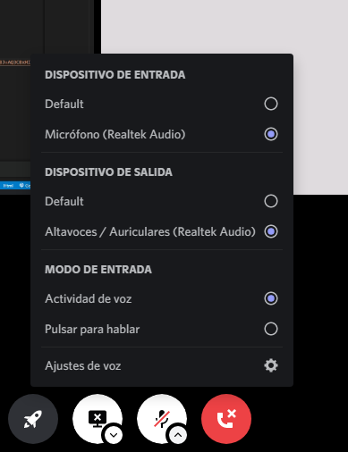
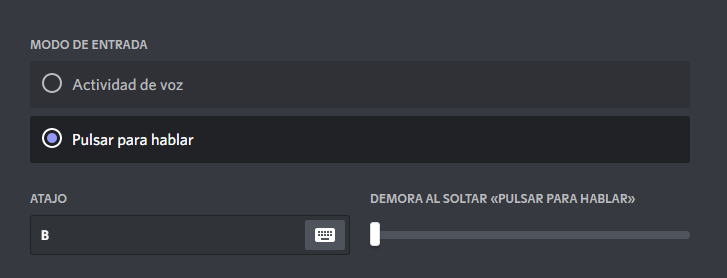

# INFORME - 01
### 20/27/2022 | 7:57 am

El problema con los micrófonos no se debe a una mala configuración de los canales de voz en discord, sino, se debe a la configuración de cada usuario; como la entrada y salida de voz y audio, así como; el modo de entrada: Actividad de voz (por defecto), Pulsar para hablar (asignar una letra par poder hablar). 

  

**Actividad por voz**: Viene por determinado en discord. Se presiona el icono del micrófono para poder hablar.

**Pulsar para hablar**: Se tiene que asignar un botón para poder hablar, podemos tener el micrófono encendido, pero no se escuchara nada, ya que deberíamos presionar el botón que le asignamos previamente. 

  

  

En resumen, la falla que tienen los usuarios al momento de hablar se debe a su configuración, además como algunos de los usuarios son nuevos en discord, talvez no tengan bien configurado los ajustes de aplicación / Voz y video.